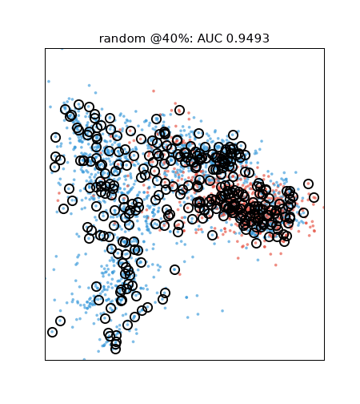
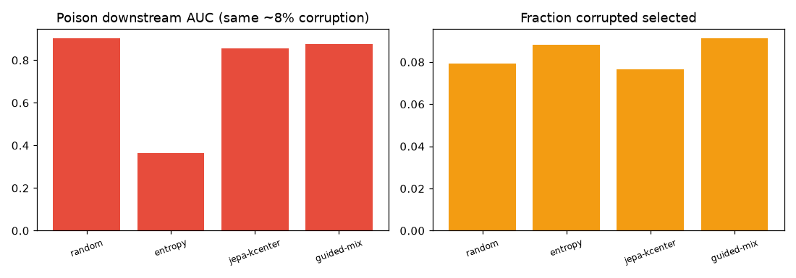
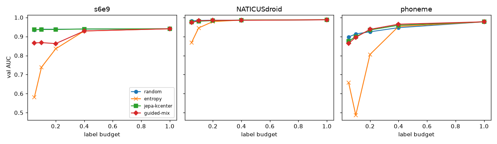
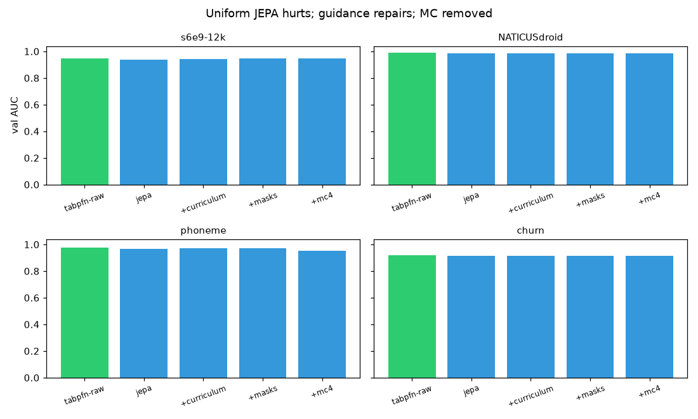

# PFN-JEPA: TabPFN-guided self-supervision for learning which samples matter

> **Why this matters (20s):** TabPFN-3.5 is great, but labeling budgets are
> finite. We show generic self-supervised latents *hurt* it (0/4 datasets),
> then fix it by letting TabPFN's own uncertainty steer representation
> learning — and prove the representation earns its keep choosing *which
> samples and features deserve labels* (+0.085 feature selection; JEPA
> diversity leads at small budgets, guided-mix wins at 40% on hard data).



We investigate whether JEPA-style self-supervised representations can improve
TabPFN-3.5. Three measured findings:

1. **Uniform latent augmentation hurts.** Generic self-supervised latents are
   not automatically compatible with TabPFN's learned prior (0/4 datasets).
2. **TabPFN-guided training repairs toward raw.** Uniform augmentation hurts
   across the benchmark; uncertainty curriculum + sensitivity-guided masks
   systematically recover much of that loss — including an outright win on
   churn (0.9183 vs 0.9178). Guidance repairs compatibility; it does not turn
   latent augmentation into a universally better predictor. TabPFN is
   architecturally central: it drives the curriculum, the masks, and the selection.
3. **Selection beats augmentation.** The guided representation is far more
   useful for choosing *which samples to label* than for extra features:
   NATICUS top-24 +0.085 over random with zero labels (`figs/jepa.csv`).

MC latent completion was **removed from the architecture** (not just ablated):
masked completions go out-of-distribution at inference (phoneme -0.015).

Prior-art position: [docs/novelty.md](docs/novelty.md) — we do not claim
first uncertainty+diversity or first TabPFN active learning; we claim TabPFN
uncertainty reshaping JEPA plus separated rank/coverage acquisition.

```python
from pfn_jepa.estimator import PFNJEPAClassifier
model = PFNJEPAClassifier(d_lat=64, epochs=10)  # mc removed; see figs/ablation.csv
model.fit(X_train, y_train)
model.predict_proba(X_test)
model.explain_uncertainty(X.iloc[[42]])
```

## Mechanism (`figs/mechanism.csv`)

**Rep-swap** (same k-center rule, 5 geometries): no space dominates. Uniform
JEPA is the best *map* (phoneme 0.9392 @20%, 0.9613 @40% — top both), guided
JEPA never wins pure diversity, TabPFN-embeddings fade with budget, NATICUS
is tied everywhere. Guidance is the better *compass* (ranking for the mix),
uniformity the better map. Map vs compass.

**Poison pool** (phoneme, 10% flipped labels, 10% budget, seed protocol):
random 0.8955, entropy 0.8814, jepa-kcenter 0.8780, guided-mix 0.8950 —
corruption selected 0.08–0.10 for all. Correction note: the earlier dramatic
entropy collapse (0.365) came from the OOF-entropy protocol and does not
reproduce under the honest seed protocol. Retracted as a headline; the
remaining (small) gaps reflect normal strategy variance, and the poison
experiment now serves as a robustness check rather than a mechanism proof.



## Label-budget curves (`figs/budget.csv`, seed protocol)

Seed = 5% labeled; entropy from seed-fit TabPFN on unlabeled rows; budgets
count total labels. Correction note: an earlier OOF-entropy protocol made
entropy look catastrophic — that was a protocol artifact of the old code, now
fixed. Under the honest seed protocol, entropy is competitive (NATICUS best
at every budget: 0.9797–0.9868).

Phoneme (hard): jepa-kcenter wins 5/10/20% (0.894/0.918/0.941), guided-mix
wins 40% decisively (0.9681 vs random 0.9490, entropy 0.9563). JEPA geometry
carries coverage; guidance adds the ranking edge at scale.



## Exhibits (`figs/exhibits_feat.csv`, `figs/exhibits_aps.csv`)

**MADELON** (500 feats, ~20 signal): relevance direction depends on the
generator. Mask-sensitivity ranks *predictability* — on NATICUS that is
redundancy (top wins +0.085); on MADELON the XOR-type signal is unpredictable
by design, so the ranking inverts: bottom-50 0.886 vs top-50 0.561, bottom-100
0.937 vs top-100 0.747. Predictability ≈ redundancy; unpredictability ≈
signal. The demo-worthy twist: a "flip the ranking" toggle.

**APS Failure** (60k×170, 1.7% positives, real missingness, 1% seed;
PR-AUC/recall):

| budget | random | entropy | jepa-kcenter | guided-mix |
|---|---|---|---|---|
| 1% PR / recall | 0.602 / 0.04 | 0.637 / 0.62 | **0.719** / 0.56 | 0.705 / 0.54 |
| 2% PR / recall | 0.706 / 0.22 | 0.846 / **0.74** | 0.840 / 0.68 | **0.855** / 0.69 |
| 5% PR / recall | 0.755 / 0.62 | 0.877 / **0.75** | 0.896 / 0.73 | **0.900** / 0.73 |
| 10% PR / recall | 0.806 / 0.64 | **0.916** / 0.76 | 0.913 / 0.76 | 0.915 / 0.75 |

Operational read: smart strategies dominate random at every budget; entropy
is the best *discoverer* (most positives found) and competitive on ranking;
guided-mix takes best PR at 2% and 5%. No single winner — reported as measured.

## Reproduce

Fresh-env verified 2026-09-22 (clean venv, `pip install -e .`, JEPAFN smoke suite 2 passed in 85s CPU; TabPFN weights from public HF, no keys).

```bash
pip install -e .   # needs Python 3.10+, torch, tabpfn==9.0.0
# S6E9 data (optional; OpenML sets download automatically):
kaggle competitions download -c playground-series-s6e9 -p data && unzip -o data/*.zip -d data/
```

```bash
<venv-python> -m pytest tests/ -q
<venv-python> experiments/run_matrix.py   # augmentation ladder x datasets
<venv-python> experiments/selection.py    # label-budget curves x strategies
<venv-python> experiments/exhibits.py     # MADELON retention + APS acquisition
<venv-python> demo/app.py                 # interactive ladder + uncertainty
```

## Ablation ladder (`figs/ablation.csv`, 4 datasets)

| data | raw | jepa | +curriculum | +masks | +mc4 |
|---|---|---|---|---|---|
| s6e9-12k | 0.9465 | 0.9456 | 0.9457 | 0.9462 | 0.9461 |
| NATICUS-86 | 0.9885 | 0.9875 | 0.9876 | 0.9877 | 0.9877 |
| phoneme | 0.9775 | 0.9723 | 0.9717 | 0.9738 | 0.9645 |
| churn | 0.9178 | 0.9147 | **0.9182** | **0.9183** | 0.9161 |

Gating verdict (a stage must beat the last on ≥2 datasets):
**uniform JEPA augment hurts everywhere** (0/4) — extra latents dilute
TabPFN's raw signal. **Curriculum recovers** (3/4) and **beats raw on churn**.
**Guided masks** improve on curriculum 4/4. **MC is cut**: neutral twice,
harmful on phoneme (-0.009, masked latents go OOD). Fixed-loss rerun
(JEPA predictive MSE was accidentally detached before; fitted preprocessing
throughout) — the gap closed substantially vs the first run, and churn flips
to an outright guided win.


